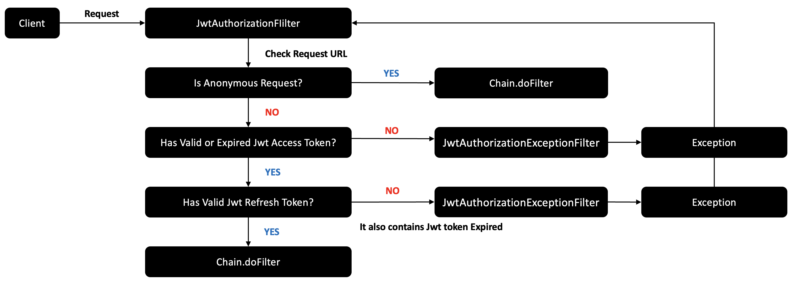

<a name="readme-top"></a>

<!-- PROJECT SHIELDS -->
<!--
*** I'm using markdown "reference style" links for readability.
*** Reference links are enclosed in brackets [ ] instead of parentheses ( ).
*** See the bottom of this document for the declaration of the reference variables
*** for contributors-url, forks-url, etc. This is an optional, concise syntax you may use.
*** https://www.markdownguide.org/basic-syntax/#reference-style-links
-->
[![Contributors][contributors-shield]][contributors-url]
[![Forks][forks-shield]][forks-url]
[![Stargazers][stars-shield]][stars-url]
[![Issues][issues-shield]][issues-url]
[![MIT License][license-shield]][license-url]

# spring-security-jwt-auth

Spring Boot, Spring security, jjwt 를 사용하여 jwt, auth를 지원하는 api 서버를 쉽게 사용할 수 있도록 만든 오픈 소스입니다.

## Contributor

| <p align="center"></p> CokeLee777 | <p align="center"></p> JSY8869 |
| --- | --- |
| <div align=center> [github](https://github.com/CokeLee777) </div> | <div align=center> [github](https://github.com/JSY8869) </div> |

## 특징(Features)

- JWT 인증을 통한 유저 회원가입과 로그인
- BCrypt를 사용한 비밀번호 암호화 - 솔팅 암호화 알고리즘을 이용해서 보안 강화
- 유저의 권한에 근거한 Spring Security 기반 인가
- 접근 성공, 실패 시 처리 규정 커스터마이징
- 로그아웃 과정 커스터마이징
- Access Token
- Refresh Token
- Cookie
- OOP

## 사용 기술(Technologies)

- Spring Boot 3.0
- Spring Security
- JSON Web Tokens (JWT)
- BCrypt
- Gradle

## 사용법(How To Use?)

### 1. Database 전략 선택(Choose your database strategy)

우선, 용도에 따라 어떤 소스를 사용할 것인지 선택하여야 합니다.

우리는 아래와 같은 소스 코드를 제공합니다.

| Database | Security |
| --- | --- |
| Memory | JWT |
| Jpa | JWT |

사용할 데이터베이스 전략에 따라 선택하여 주십시오.

### 2. 프로젝트 세팅(Set your project)

1. 우선, build.gradle 파일의 내용에 따라 spring boot 개발 환경을 세팅하세요.
2. [application.properties](src/main/resources/application.yml) 내에 아래와 같은 코드를 작성합니다. (이 프로젝트에는 기본적으로 해당 코드가 포함되어 있습니다.)

```yml
# 커스텀 NOT FOUND ERROR를 생성하기 위해 기본 page not found exception 제거
spring:
  mvc:
    throw-exception-if-no-handler-found: true
  web:
    resources:
      add-mappings: false
  datasource:
      driver-class-name: com.mysql.cj.jdbc.Driver
      url: jdbc:mysql://"your domain or ip address":"your port number"/"your database name"
      username: "database username"
      password: "database user password"
  jpa:
      generate-ddl: true
      hibernate:
        ddl-auto: create
      properties:
        hibernate:
          format_sql: true
```

1. 당신의 보안 전략에 맞는 폴더를 프로젝트에 적용시킵니다.
    - Memory를 사용하는 경우 application.properties의 datasource 부분과 jpa부분, build.gradle의 ``implementation 'mysql:mysql-connector-java:8.0.33'``를 삭제하여야 합니다.
    - 이 프로젝트의 소스 코드의 구조는 **어노테이션**으로 분리되어 있습니다.
    - `Choose your security strategy` 단계에서 선택한 전략에 맞게 `SpringSecurityJwtAuthApplication` 파일에서 어노테이션을 선택하여야 합니다.
        - Memory를 사용하는 경우
        
        ```docker
        @ComponentScan(excludeFilters = @ComponentScan.Filter(type = FilterType.ANNOTATION, classes = DataBase.class))
        ```
        
        - Database를 사용하는 경우
        
        ```docker
        @ComponentScan(excludeFilters = @ComponentScan.Filter(type = FilterType.ANNOTATION, classes = Memory.class))
        ```
        

### 3. 커스터마이징(Customize)

- User를 직접 만들고 싶은 경우에는`common.entity.User` interface를 구현하여 주세요.
    - 이 프로젝트에서 JWT 토큰에는 유저의 Id(PK)와 Identifier, Password가 들어갑니다. 이에 주의하여 주세요.
- 아래와 같이 정의된 END_POINT를 커스터마이징 하세요.

| LOGOUT_END_POINT | PUBLIC_END_POINT | ANNONYMOUS_END_POINT |
| --- | --- | --- |
| “/user/sign-out” | “/” | "/", "/users/sign-in", "/users/sign-up" |
- JWT를 사용하는 경우 TokenProperties의 `SECRET_KEY`, `REFRESH_KEY`를 커스타미이징 해주세요. 이는 토큰 생성 시 비밀 키의 역할을 하며 보안을 위해 외부에 노출되지 않도록 주의하여 주세요.
- `UserRepository`를 커스타미이징 할 때는 `UserRepository` 인터페이스를 구현하여야 합니다.

# 토큰 정보(Informations of Token)

## JWT

- JWT 토큰은 [JJWT](https://github.com/jwtk/jjwt) 라이브러리를 통해 생성합니다.
- 자세한 응답은 [API 명세서](https://github.com/CokeLee777/spring-security-jwt-auth/wiki/API-Specification)를 참고하세요.
- Refresh Token은 Set-Cookie라는 이름으로 헤더를 통해 전달합니다. **반드시 사용자는 쿠키에 Refresh Token을 저장하여야 합니다.**

# JWT 인증 및 인가 동작 원리

### 인증(Authentication) - 로그인(Sign In)

**[대략적인 인증 흐름]**


**[실제 인증 흐름]**

1. 사용자가 로그인 경로('/users/sign-in)로 로그인 요청을 시도하게 됩니다.
2. AntPathRequestMatcher는 요청한 URL이 로그인 요청인지 검증합니다.
    - 요청한 URL이 로그인 요청이 아니라면 다음 필터로 넘어가게 됩니다.
3. 현재 요청한 사용자가 이미 인증되었는지 아닌지 확인하고, 이미 인증이 된 사용자라면 403 FORBIDDEN 응답을 내보내게 됩니다.
4. 사용자가 보낸 아이디, 비밀번호 정보를 검증하고 검증이 완료되었다면 가짜 인증객체를 만들어서 AuthenticationManager에게 실제 인증을 요청합니다.
5. AuthenticationManager는 JwtAuthenticationProvider에게 실제 인증을 위임하고, JwtAuthenticationProvider는 실제 DB에서 사용자 아이디와 비밀번호를 검증합니다.
    - 사용자의 아이디가 존재하지 않거나 비밀번호가 다르다면 401 UNAUTHORIZED 응답을 내보내게 됩니다.
6. 인증이 완료되었다면 실제 인증 객체를 만들어서 반환하고 스프링이 전역적으로 참조할 수 있도록 시큐리티 컨텍스트에 저장합니다.
7. 마지막으로 모든 과정이 성공적으로 마쳤다면 사용자에게 Access Token과 Refresh Token을 발급하여 응답합니다.

### 인가(Authorization) - 로그인 유지 또는 사용자 권한 검증

**[대략적인 인증 흐름]**



**[실제 인증 흐름]**

1. 사용자가 원하는 아무 페이지나 요청을 시도합니다.
2. 사용자의 토큰 정보를 확인합니다.
    - 사용자의 토큰이 없고, Anonymous 페이지 요청이라면 다음 필터로 이동합니다.
    - 사용자의 토큰이 없고, 인증이 필요한 페이지 요청이라면 403 FORBIDDEN 응답을 내보내게 됩니다.
3. 사용자의 Jwt Access Token을 검증한다. 단순히 토큰이 만료되었다면 Jwt Refresh Token 검증 단계로 넘어갑니다.
    - 토큰이 변조되었다면 예외를 발생시키고 상황에 맞는 응답(400, 401, 403)을 내보내게 됩니다.
4. 사용자의 Jwt Refresh Token을 검증합니다.
    - 토큰이 만료되었다면 304 MOVED PERMANENTLY(/users/sign-in) 응답을 내보내게 됩니다.
    - 토큰이 변조되었다면 예외를 발생시키고 상황에 맞는 응답(400, 401, 403)을 내보내게 됩니다.
5. 모든 과정이 정상적으로 성공했다면 다음 필터로 이동합니다.

### 로그아웃(Sign out) - 로그아웃 또는 사용자 권한 해제

**[대략적인 인증 흐름]**


**[실제 인증 흐름]**

1. 인증된 사용자가 로그아웃 요청을 시도합니다.
2. AntPathRequestMatcher는 요청한 URL이 로그아웃 요청인지 검증합니다.
    - 요청한 URL이 로그아웃 요청이 아니라면 다음 필터로 넘어갑니다.
3. 시큐리티 컨텍스트에서 인증 객체를 꺼내서 핸들러에게 넘겨줍니다.
4. 핸들러는 리프레쉬 토큰이 들어있는 쿠키를 삭제하고, 시큐리티 컨텍스트를 비우게 됩니다.
    - 액세스 토큰이 있는 헤더는 클라이언트가 헤더에서 삭제하도록 합니다.
5. 모든 과정이 성공적으로 마쳤다면 304 MOVED PERMANENTLY(/users/sign-in) 응답을 내보내게 됩니다.

## [기능 정의서(**Functional Specification)**](https://github.com/CokeLee777/spring-security-jwt-auth/wiki/Functional-Specification)

## [API 명세서(API Specification)](https://github.com/CokeLee777/spring-security-jwt-auth/wiki/API-Specification)

## 객체 지향 프로그래밍

이 프로젝트는 OOP(객체 지향 프로그래밍)를 지향하며 설계 및 개발되었습니다.

객체를 중심으로 생각하고 판단하였으며 **[SOLID](https://en.wikipedia.org/wiki/SOLID)** 원칙에 따라 구현되었습니다.

### SRP(단일책임의 원칙)

- 단일책임의 원칙에 따라 한 클래스 or 한 객체가 하나의 책임만을 가지도록 설계 및 구현하였습니다.
- 토큰의 생성을 책임지는 `creator` 클래스와 생성된 토큰을 토큰 객체로 만들어서 반환하는 `provider` 클래스로 분리하는 등의 행동을 통해 단일책임의 원칙을 지킬 수 있도록 하였습니다.

### OCP(개방폐쇄의 원칙)

- 개방폐쇄의 원칙에 따라 확장에는 열려있지만 변경에는 닫혀있도록 구성요소를 설계하였습니다.
- 최상위 인터페이스인 `USER` 클래스를 통해 `Memory` 전략과 DB 전략에서 사용할 `USER` 클래스를 각각 구현하도록 설계하였습니다. 이에 따라 `Generic`을 활용하여 `repository` 인터페이스를 구현할 때 `User`의 구현체에 따라 반환값이 정해지도록 설계하였습니다.
- 또한, 각각의 클래스들은 인터페이스를 의존하도록 설계하여 OCP의 가장 중요한 메커니즘인 추상화와 다형성을 적극적으로 지향하였습니다.
- 위와 같은 설계를 통해 `USER`에 대한 확장성을 열어두고, `USER` 인터페이스가 변경될 수 없도록 설계하였습니다.

### LSP(리스코프 치환의 원칙)

- 리스코프 치환의 원칙에 따라 상위 인터페이스의 목적에 맞게 하위 클래스에서 구현하였습니다.
- 각각의 인터페이스에 대한 구현체는 인터페이스의 책임과 목적에 맞게 구현하였으며, 이를 통해 사용자는 인터페이스를 의존하여 해당 인터페이스의 구현체의 메서드를 사용하더라도 인터페이스의 목적에 맞는 결과를 반환받도록 설계하였습니다.

### ISP(인터페이스 분리의 원칙)

- 인터페이스 분리의 원칙에 따라 인터페이스로 책임과 역할을 분리하였습니다.
- `JwtTokenService` 클래스에서는 `Access Token`과 `Refresh Token`의 발급과 복호화 기능을 제공합니다. 하지만 발급과 복호화를 모든 곳에서 사용하진 않기 때문에 `Access Token`과 `Refresh Token` 각각의 발급에 대한 인터페이스와 복호화 기능을 제공하는 인터페이스로 분리하여 사용자에게 필요한 기능을 제공하는 인터페이스만을 의존하여 사용하도록 구현하였습니다.

### DIP(의존성역전의 원칙)

- 의존성역전의 원칙에 따라 상위 모듈을 가장 추상적인 인터페이스로 추상화 하여 하위 모듈에 의존하지 않도록 설계하였습니다.
- 이 프로젝트는 2가지의 Database 전략을 제공하기 때문에 2가지의 User 엔티티를 제공합니다. 이에 따라 2가지 User에 대한 Service를 구현하였습니다. 이 때 최상위 인터페이스인 `UserService` 인터페이스를 통해 추상화 하였고, 메서드의 반환값에 Generic을 사용하여 새로운 Database 전략을 추가 하더라도 User 인터페이스를 구현한 User 관련 엔티티 클래스를 반환하는 방식으로 `UserService`를 새롭게 구현할 수 있도록 설계하였습니다.

## **기여하는 방법(How to contribute?)**

Contributions are what make the open source community such an amazing place to learn, inspire, and create. Any contributions you make are **greatly appreciated**.

If you have a suggestion that would make this better, please fork the repo and create a pull request. You can also simply open an issue with the tag "enhancement".
Don't forget to give the project a star! Thanks again!

1. Fork the Project
2. Create your Feature Branch (`git checkout -b feature/AmazingFeature`)
3. Commit your Changes (`git commit -m 'Add some AmazingFeature'`)
4. Push to the Branch (`git push origin feature/AmazingFeature`)
5. Open a Pull Request

## License

Distributed under the MIT License. See [LICENSE](./LICENSE) for more information.

<!-- MARKDOWN LINKS & IMAGES -->
<!-- https://www.markdownguide.org/basic-syntax/#reference-style-links -->
[contributors-shield]: https://img.shields.io/github/contributors/CokeLee777/spring-security-jwt-auth.svg?style=for-the-badge
[contributors-url]: https://github.com/CokeLee777/spring-security-jwt-auth/graphs/contributors
[forks-shield]: https://img.shields.io/github/forks/CokeLee777/spring-security-jwt-auth.svg?style=for-the-badge
[forks-url]: https://github.com/CokeLee777/spring-security-jwt-auth/network/members
[stars-shield]: https://img.shields.io/github/stars/CokeLee777/spring-security-jwt-auth.svg?style=for-the-badge
[stars-url]: https://github.com/CokeLee777/spring-security-jwt-auth/stargazers
[issues-shield]: https://img.shields.io/github/issues/CokeLee777/spring-security-jwt-auth.svg?style=for-the-badge
[issues-url]: https://github.com/CokeLee777/spring-security-jwt-auth/issues
[license-shield]: https://img.shields.io/github/license/CokeLee777/spring-security-jwt-auth.svg?style=for-the-badge
[license-url]: https://github.com/CokeLee777/spring-security-jwt-auth/blob/master/LICENSE.txt
